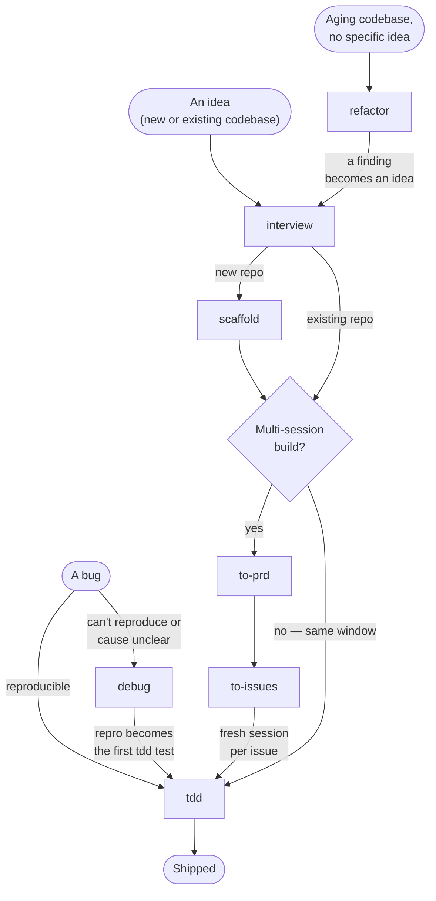

# Pyxis

Pyxis is an installable Python agent workflow: one `AGENTS.md` rule base plus a matching skill pack. It gives coding agents a boring Python stack (`uv`, `ruff`, `ty`, `pytest`, `hypothesis`, `prek`) and a clear path from idea to shipped code: scaffold green projects, build test-first, and debug by reproducing first.

Two parts:

- **`AGENTS.md` base**: agent-agnostic rules for any tool that reads `AGENTS.md` (Claude Code, Cursor, Codex, opencode, …). If your agent has no skills runtime, the base still carries most of the workflow.
- **Skill pack**: the procedures. It runs on any skills.sh-compatible agent; Claude Code specifics stay in labeled `> Claude Code:` asides.

## Install

```bash
npx skills add DavisMcCracken/pyxis                     # all eight skills
npx skills add DavisMcCracken/pyxis --skill scaffold    # one skill
```

Install only copies `skills/`. `model-tests/` and `examples/` are maintainer artifacts. No skills tool? Copy `skills/` into `~/.claude/skills/`. No skills runtime at all? Use the bootstrap lines at the top of [`AGENTS.md`](AGENTS.md).

## The flow

Pick the closest starting point and follow the arrows. Most work lands on the `interview` → `tdd` spine.



Not shown: **`handoff`**. It can happen from any long phase. When context nears the model's smart-zone, run it and start fresh from the file it writes.

| Skill | Reach for it when |
|---|---|
| [`interview`](skills/interview/SKILL.md) | Sharpen an idea or plan. Start here. |
| [`scaffold`](skills/scaffold/SKILL.md) | Start a new Python project with the green verify loop already in place. |
| [`to-prd`](skills/to-prd/SKILL.md) | Capture a settled multi-session design as a PRD. |
| [`to-issues`](skills/to-issues/SKILL.md) | Split a PRD into independent, agent-ready issues. |
| [`tdd`](skills/tdd/SKILL.md) | Build a feature or fix an ordinary reproducible bug, one red-green-refactor slice at a time. |
| [`debug`](skills/debug/SKILL.md) | Reproduce a hard, intermittent, or unclear bug before fixing it. |
| [`refactor`](skills/refactor/SKILL.md) | Find shallow modules and deepen them. |
| [`handoff`](skills/handoff/SKILL.md) | Compact a long thread so a fresh session can resume it. |

[skills/README.md](skills/README.md) has the step-by-step hand-offs between skills, the shared principles they all follow, and deploy notes.

## Repository layout

| Path | What | Audience |
|---|---|---|
| [skills/](skills/) | The installable skill pack and `_shared/` references | Users |
| [AGENTS.md](AGENTS.md) | The rule base. Canonical template: `skills/scaffold/templates/AGENTS.md`, which `/scaffold` copies into new repos. | Users |
| [CLAUDE.md](CLAUDE.md) | `@AGENTS.md`, so Claude Code reads the same rules | Users |
| [examples/](examples/) | Reference projects built under the rules (`wordstats`, `ttlcache`, `spike_dedupe.py`) | Maintainers |
| [model-tests/](model-tests/) | Tests for how well a model follows the workflow | Maintainers |
| [PRD.md](PRD.md) · [DEVELOPMENT.md](DEVELOPMENT.md) · [PROJECT-STATUS.md](PROJECT-STATUS.md) | Requirements, contribution/release workflow, and current status | Maintainers |
| [archive/](archive/) | History (original draft) | — |

## Provenance

Pyxis started from [Matt Pocock's skills](https://github.com/mattpocock/skills): same structure and sequencing, rewritten for Python. The `AGENTS.md` base came from building the `examples/` projects under its own rules and folding the findings back into the template.

## License

[MIT](LICENSE).
