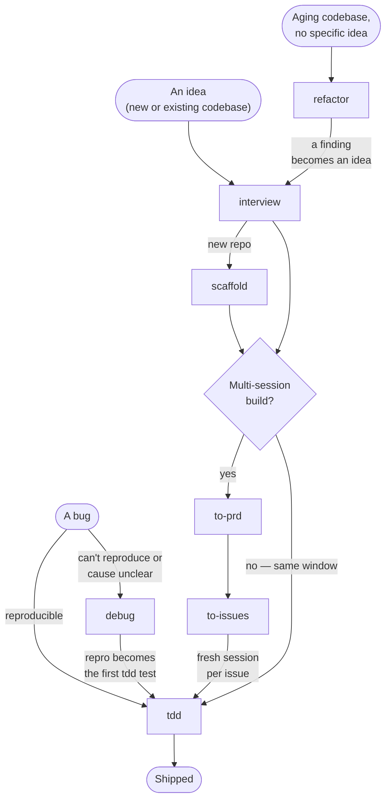

# Pyxis

A Python agent workflow you can install: an `AGENTS.md` rule base plus a matching skill pack — uv + ruff + ty + pytest + hypothesis + prek, with tiered test-driven development built in. Install the pack and your coding agent scaffolds new Python projects green from commit zero, builds features test-first, and debugs reproduce-first — guided from idea to ship by one clear skill flow.

Two layers, two reaches:

- **`AGENTS.md` base** — agent-agnostic rules. Any agent that reads `AGENTS.md` (Claude Code, Cursor, Codex, opencode, …) follows them. No skills runtime? The base alone still does most of the work.
- **Skill pack** — the procedures. Runs on any skills.sh-compatible agent; anything Claude-Code-specific is quarantined in a labelled `> **Claude Code:**` aside the reader can skip.

## Install

```bash
npx skills add DavisMcCracken/pyxis                     # all eight skills
npx skills add DavisMcCracken/pyxis --skill scaffold    # or just one
```

Only the `skills/` pack is installed — `model-tests/` and `examples/` are maintainer artifacts and never reach your install. No skills tool? Copy `skills/` into `~/.claude/skills/` by hand. Working without skills at all: follow the bootstrap lines at the top of [`AGENTS.md`](AGENTS.md).

## The flow

Match your situation to an entry point; most work then travels one spine, idea to shipped code.



One skill sits outside the graph: **`handoff`** is the bridge between context windows — run it from any long phase when context nears the model's smart-zone, and a fresh session picks up from the file it writes.

| Skill | Reach for it when |
|---|---|
| [`interview`](skills/interview/SKILL.md) | Sharpening an idea or plan — the head of every flow |
| [`scaffold`](skills/scaffold/SKILL.md) | Starting a new Python project — green verify loop from commit zero |
| [`to-prd`](skills/to-prd/SKILL.md) | Capturing a settled multi-session design as a PRD |
| [`to-issues`](skills/to-issues/SKILL.md) | Splitting a PRD into independent, agent-ready issues |
| [`tdd`](skills/tdd/SKILL.md) | Building a feature or fixing an ordinary bug — red-green-refactor slices |
| [`debug`](skills/debug/SKILL.md) | A hard, intermittent, or unclear-cause bug needs reproduce-first investigation |
| [`refactor`](skills/refactor/SKILL.md) | Improving architecture — find shallow modules and deepen them |
| [`handoff`](skills/handoff/SKILL.md) | Crossing context windows — compact a thread so a fresh session resumes it |

[skills/README.md](skills/README.md) has the step-by-step hand-offs between skills, the shared principles they all follow, and deploy notes.

## Repository layout

| Path | What | Audience |
|---|---|---|
| [skills/](skills/) | The installable skill pack, plus `_shared/` references | Users |
| [AGENTS.md](AGENTS.md) | The rule base governing this repo. Canonical template: `skills/scaffold/templates/AGENTS.md` (what `/scaffold` stamps into new repos) | Users |
| [CLAUDE.md](CLAUDE.md) | One line — `@AGENTS.md`, so Claude Code reads the same rules | Users |
| [examples/](examples/) | Reference projects built under the rules: `wordstats`, `ttlcache`, `spike_dedupe.py` | Maintainers |
| [model-tests/](model-tests/) | Battery measuring how well a model follows the workflow | Maintainers |
| [PRD.md](PRD.md) · [DEVELOPMENT.md](DEVELOPMENT.md) · [PROJECT-STATUS.md](PROJECT-STATUS.md) | Requirements, contribution/release workflow, current status | Maintainers |
| [archive/](archive/) | History (original draft) | — |

## Provenance

Skill pack derived from [Matt Pocock's skills](https://github.com/mattpocock/skills) — structure and sequencing kept, prose rewritten, Python-grounded. The `AGENTS.md` base was developed and then validated by building the `examples/` projects under its own rules; findings fed back as patches.

## License

[MIT](LICENSE).
